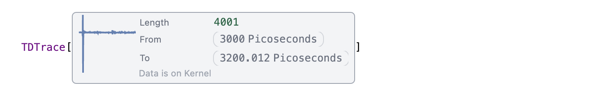
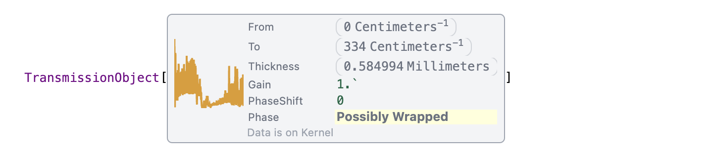
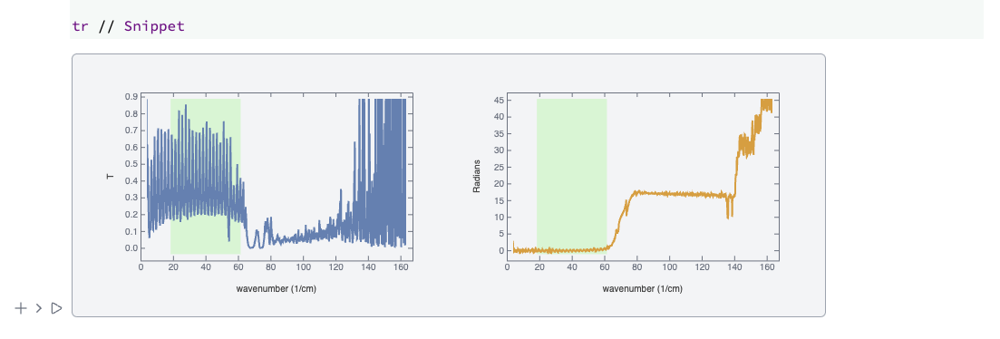
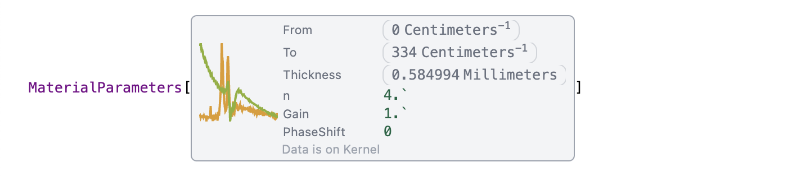
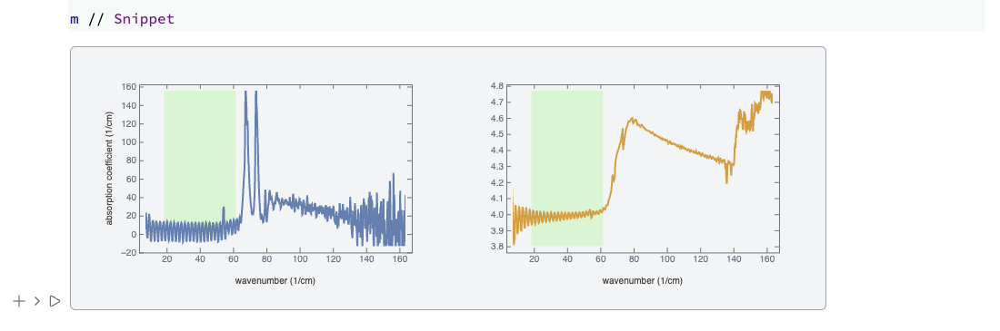

# Time-Domain Spectroscopy Tools 🧰
A small library for high-precision material parameter extraction from time-domain THz signals, written in Wolfram Language 🐺 and OpenCL 🏎️

*Developed at University of Augsburg, Germany 🇩🇪*

<h4>Beta testing ♲</h4> 

> <h4>Processed <span style="color:white; background:teal; border-radius:8px; padding:0 0.5rem 0 0.5rem;">3411</span> THz spectra from 2021 to 2024</h4>

> acquired using TDS-THz 200ps Spectrometer *Toptica TeraFlash* 📸

## Features
- Fabry-Pérot deconvolution ⭐️
- Informed Automatic / semi-automatic phase unwrapping
- High precision / various approximation methods for $n$, $\kappa$, and $\alpha$ solving
- GUI Helpers (available only on WLJS Notebook platform) 🌟
- Works for both thin and thick samples
- **GPU Acceleration** (OpenCL, if not available it fallbacks on C version) ⭐️ 
- Kramers-Kronig approximation of $n$ feature (if needed)
- Functional approach, no hidden state
- Syntax sugar with data preview ⭐️
- Jitter-proof


## See it in action! ⏱️
[An online example](https://jerryi.github.io/wl-tds-tools/Basic.html) on how to work with it.

## Applications
- [TeraKitchen: A WLJS Application for Automated TDS-THz Spectroscopy Analysis](https://github.com/JerryI/TK)


## Examples of processed TDS

GaGe 0.4mm semiconductor


Fe2Mo3O8 0.4mm dielectric


## Supported configurations 📸
- [x] Transmission
- [ ] Reflectivity


## Installation 
### Option 1
Install locally using [LPM](https://github.com/JerryI/wl-localpackages)

```mathematica
PacletRepositories[{
    Github -> "https://github.com/JerryI/wl-tds-tools" -> "master"
}]
```

### Option 2
Clone this repository into your project folder and run:
```mathematica
    PacletDirectoryLoad["wl-tds-tools"]
```

## Library Interface 

We separate the toolbox into 3 contexts:

- ``JerryI`TDSTools`Trace` `` : operates with raw time-traces.
- `` JerryI`TDSTools`Transmission` `` : constructs transmission objects from sample and reference time-traces.
- `` JerryI`TDSTools`Material` `` : extracts material parameters from transmission objects.
- `` JerryI`TDSTools`Wizard` `` : sets of helper widgets.


### Time-traces ⤵️
To construct a time-trace object from a table, use:

#### TDTrace
```mathematica
TDTrace[q_QuantityArray] _TDTrace
```



This accepts a `QuantityArray`. The units for the time-step or frequency-step must be provided. For example

```mathematica
tds = {
    {3010.1, 0.1},
    {3011.2, 0.2},
    ...
};

tds = TDTrace[QuantityArray[tds, {"Picoseconds", 1}]]
```

Of you have already a fourier transformed data, supply it in the units of wavenumber. For example, taking the output of `tds` one can recreate an original time-trace from the spectrum

```mathematica
TDTrace[tds["Spectrum"]]
```

#### Properties
Any property can be accessed as a down-value

```mathematica
tds["Properties"]
```

Here is a list
- `"Properties"` : lists all available keys
- `"Spectrum"` : return `QuantityArray` with a complex amplitude spectrum (automatically resampled in a case of jitter issues). *Read-only*
- `"PowerSpectrum"` : returns `QuantityArray` of power spectrum. *Read-only*
- `"Trace"` : return `QuantityArray` of the original time-trace. *Read-only*
- `"FDCI"` : a range of frequency-domain confidence interval. It is generated according to the powerspectrum and provides a coarse estimation of the working range in wavenumbers. This interval will be used later for optimizing material parameters. *Read-only*

### Reconstructing transmission function ⤵️
On the next step we can derive an initial information about the transmission based on the sample and reference time-traces

#### TransmissionObject
A constructor
```mathematica
TransmissionObject[sam_TDTrace, ref_TDTrace, "Thickness"->_Quantity, opts___] _TransmissionObject
```



it creates a special object, calculates fourier images, fixes possible jitter issues and estimates the transmission function, i.e.

$$
\hat{t} = \frac{E_{sam}(\omega)}{E_{ref}(\omega)}
$$

#### Options
One can provide the following `opts` to the constructor
- `"Thickness"` : mandatory field. Must be `_Quantity`
- `"Gain"` : a scaling factor for the amplitude of `sam`. By the default is `1.0`
- `"PhaseShift"` : a constant offset in a multiples of `2Pi` to the whole phase of the transmission function. Must be `_Integer`. By the default is `0`.


#### Properties
- `"Properties"` : lists all keys
- `"Thickness"` : returns `Quantity` object with a thickness of the material
- `"\[Delta]t"` : returns estimated time-delay between the sample and the reference signals. *Read-only*
- `"Gain"` : returns a multiplier for `sam` signal
- `"PhaseShift"` : returns a constanst offset of the phase in multples of `2Pi`
- `"n0"` : returns DC refractive index, it will be updated if one change the thickness of the material using append *Read-only*
- `"Date"` : returns date, when an object was modified last time
---
- `"Frequencies"` : returns `QuantityArray` of the whole range of frequencies. *Read-only*
- `"Transmission"` : returns the power transmission `QuantityArray`, i.e. array of $|\hat{t}(\omega)|^2$. *Read-only*
- `"Phase"` : returns the argument of $\hat{t}$ sampled as a function of frequency in a form of `QuantityArray`. After the creation is wrapped and cannot be used before unwrapping process (see later). *Read-only*
- `"Phase Features"` : returns quantity array of `"Phase"` with subtracted DC contribution of the refractive index
- `"Kramers-Kronig n"` : (approximatiton!) returns quantity array of refractive index derived from the transmission using Kramers-Kronig relation (discrete)
---
- `"Approximated n"` : (approximatiton!) returns quantity array of refractive index derived from the phase directly
- `"Approximated k"` : (approximatiton!) returns quantity array of imaginary refractive index derived from the transmission directly
- `"Approximated \[Alpha]"` : (approximatiton!) returns quantity array of absorption coefficient derived from the transmission directly
---
- `"Domain"` : returns the ranges of frequencies. *Read-only*
- `"FDCI"` : a range of frequency-domain confidence interval. It is generated according to the powerspectrum and provides a coarse estimation of the working range in wavenumbers. This interval will be used later for optimizing material parameters. *Read-only*
- `"FDCI2"` : it serves the same purpose as `FDCI` (as a criteria parameter), but relies on the phase information. It cannot be with a wrapped phase. *Read-only*

#### How to update transmisstion object
One can update properties of an object without recreating it fully using `Append`

```mathematica
new = Append[tr, "Thickness"->Quantity[1.2, "Millimeters"]]
```

or multiple properties
```mathematica
new = Append[tr, {"Thickness"->Quantity[1.2, "Millimeters"], "Gain"->0.9}]
```

It returns a new object, while the raw data is shared between them internally.

#### Math operations
You can substract, add, multiply by any complex numbers `TransmissionObject` even if they have different length or sampling

```mathematica
tr // Snippet
tr + 0.5 I tr // Snippet
```

The data will be automatically resampled and a new object created.

#### Phase unwrapping 
A key challenge in digital signal processing is managing the phase of the signal. To address this, phase unwrapping is employed, which transforms a discontinuous phase signal into a continuous one

```mathematica
TransmissionUnwrap[t_TransmissionObject, type_String, opts___] _TransmissionObject
```

it performs phase-unwrapping procedure on `t` object and returns a new `TransmissionObject` with a modified phase. There is only one sheme specified by `type` for unwrapping is available for now 

##### type
###### Automatic unwrapping
- `"Basic"` or `Automatic` : uses informed phase unwrapping based on a time-delay between the sample and the reference signals

###### Semi-automatic
- `"Held"` or `"Hold"` or `"Manual"` : uses informed phase unwrapping based and returns a held expression with all phase shifts calculated for further modifications by a user.

If `ReleaseHold` is applied the result will be the same as for `Automatic` type. To take advantage of held unwrapping, i.e. apply your adjustmenets to individual points you need to define a wrapper function. For example, this one will act like identity operation

```mathematica
myPhaseTransform[Hold[callback_[{parts_, joints_}]]] := Module[{
  myJoints = joints
},
  (* modify points *)

  callback[{parts, myJoints}]
]

newObject = TransmissionUnwrap[object, "Held"] // myPhaseTransform
```

the structure of `parts` and `joints` are
```
{part1  : {{wavenumber1, phase1}, ..}, part2 : {{wavenumberk, phasek}, ..}}
{joint1 : {sign12, phaseJump12}, ..}
```

where `sign12` denotes the sign of a phase jump between parts, while `phaseJump12` is suggested by automatica unwrapper an integer to compenstate this discontinuity. 


#### Options
- `"PhaseThreshold"` : sets the treshold for a detector to remove `2Pi` jump. By the default is `5.6`
- `"PhaseShift"` : overrides a constant phase offset parameter to be used later in material parameters extraction

#### How to make a preview for a transmisstion object
##### `Snippet`
To show the quick preview of your data evalaute

```mathematica
Snippet[t_TransmissionObject]
```




### Material Parameters ⤵️
This the main goal of all optical spectroscopy: use EM waves to probe the responce function of the material to extract all useful properties. Here we focus on $n$ and $\kappa$ (or their derivatives).

#### MaterialParameters 
A constructor and executor
```mathematica
MaterialParameters[t_TransmissionObject, opts___] _MaterialParameters
```
return `MaterialParameters` object, which contains all information about `n`, `k`, `\[Alpha]` (absorption coefficient). Depending on provided options it can use different methods to extract them



It can also accept a list with multiple transmission objects and process them as a batch

```mathematica
MaterialParameters[{t__TransmissionObject}, opts___] _List
```

#### Options
- `"Target"` : specifies the target device to be used `"CPU"` or `"GPU"` (OpenCL). By the default is `"CPU"`
- `"SolveNKEquations"` : enables high-persicision $n$ and $\kappa$ extraction (by solving iteratively equations compling them with transmission and phase). The default value is `True`.
- `"NKCycles"` : number of interations for solving nk-equations. The default is `30`.
- `"MovingAverageFilter"` : enables moving average filter (kernel is 2). By the default is `True`.
- `"FabryPerotCancellation"` : enables deconvolution procedure asumming a normal incidence and a perfect slab-like sample. By the default is `True`. DOI: 10.1117/12.612946 
- `"FabryPerotCycles"` : number of iterations for deconvolution procedure. The default is `8`.

#### Notes on GPU target
It uses OpenCL API to work with GPU devices and picks up the fastest available. If the device does not support OpenCL (or problems with drivers), library will fall back to CPU target.

#### Properties
All properties are *read-only*.
- `"Domain"` : frequency range. 
---
- `"Frequencies"` : returns `QuantityArray` of frequencies
- `"Transmission"` : returns `QuantityArray` of a power transmission. If `FabryPerotCancellation` is applied, it will return deconvoluted spectrum. 
- `"Best Transmission"` : returns `"Transmission"` selected in the region of `"FDCI"`
- `"Phase"` : returns `QuantityArray` of the phase of the transmissino function.
- `"Phase Features"` : returns quantity array of `"Phase"` with subtracted DC contribution of the refractive index 
- `"Best Phase"` : returns `"Phase"` selected in the region of `"FDCI"`
- `"Best Phase Features"` : returns quantity array of `"Phase"` with subtracted DC contribution of the refractive index  in the region of `"FDCI"`
---
- `"\[Alpha]"` : returns `QuantityArray` of extracted absorption coefficient.
- `"Raw \[Alpha]"` : returns `"\[Alpha]"` without FP cancellation applied.
- `"n"` : returns extracted real part of refractive index as `QuantityArray`.
- `"k"` : returns extracted imaginary part of refractive index as `QuantityArray`.
- `"Raw k"` : returns `"k"` without FP cancellation applied.
- `"Best \[Alpha]"` : returns `"\[Alpha]"` in the region of `"FDCI"`.
- `"Best Raw \[Alpha]"` : returns `"\[Alpha]"` without FP cancellation applied in the region of `"FDCI"`.
- `"Best n"` : returns `"n"` in the region of `"FDCI"`.
- `"Best k"` : returns `"k"` in the region of `"FDCI"`.
- `"Best Raw k"` : returns `"k"` without FP cancellation applied in the region of `"FDCI"`.
---
- `"Thickness"` : returns the thickness of the material
- `"Gain"` : returns gain of the sample signal (or an amplitude transmission function).
- `"PhaseShift"` : returns a constanst offset of the phase in multples of `2Pi`
---
- `"FDCI"` : a range of frequency-domain confidence interval. It is generated according to the powerspectrum and provides a coarse estimation of the working range in wavenumbers. This interval will be used later for optimizing material parameters. 
- `"FDCI2"` : it serves the same purpose as `FDCI` (as a criteria parameter), but relies on the phase information. It cannot be with a wrapped phase. 
- `"FPReduction"` : a quality factor of Fabry-Perot fringes reduction. `1.0` or close to it means the deconvolution procedure was not succesfull. The higher - the better.

#### Preview the data
Apply `Snippet` on your object to get a formatted preview

```mathematica
Snippet[m_MaterialParameters]
```




#### Optimizing parameters
The main issue is inaccuracy in `"Thickness"` and `"Gain"`, which comes naturally in a measurements. In this case a slight misaligment can make your results look much worse, when `FabryPerotCancellation` is enabled.

In order to fix this, one can vary those parameters in a fixed range and plot a contour map of `FPReduction` factor. For example

```mathematica
...
tr = TransmissionObject[...];
utr = TransmissionUnwrap[tr, "Basic"];

(* vary thickness and gain *)
map = Table[With[{
  t = Append[utr, {
    "PhaseShift"->1, 
    "Gain"->gain, 
    "Thickness"->Quantity[thickness, "Millimeters"]
    }]
},
  {thickness, gain, t}
], {thickness, 0.4-(15 0.01), 0.4+(15 0.01), 0.01}, {gain, 0.6, 1.2, 0.1}];

map = Flatten[map,1];

(* extract nk and estimate FPReduction *)
map[[All,3]] = #["FPReduction"] &/@ MaterialParameters[map[[All,3]]];

ListContourPlot[map, PlotLegends->Automatic]

(* find the best parmaeters *)
MaximalBy[map, Last]
```

as a result you will see a streched spot on the contour plot, which corresponds (probably) to the best pair 


The processed data will look like


#### Bath processing (GPU only) 🪈
If you vary the parameters of the same `TransmissionObject` to avoid extra transactions to GPU, one can use provide the set as a list to `MaterialParameters` contructor

```mathematica
MaterialParameters[map[[All,3]], "Target"->"GPU"]
```

this function will group them by `Phase` arrays (comparison by the internal reference will be used, no actual evaluation) and then feed to GPU with shared initial data.

This also takes advantage of non-blocking execution model of OpenCL and loads all data at once.

### Palette
Shows all symbols used in the library (will be shown in a new window)

```mathematica
TDSPalette[]
```

### Time-Domain Wizards

```mathematica
TDSWizard[]
```

The general interface is

```mathematica
TDSWizard[interface_, opts___][p_Promise | a_Association | traces__TDTrace | transmission__TransmissionObject] _Promise
```

It always returns `Promise`, which allows to chain different widgets together in a series

#### Options
- `InheritParameters` : default is `False`. Allows to memorize the previous parameters used and reuse them as an initial values for the rest of the batch
- all other options inherited from `TDTrace`, `TransmissionObject` and `MaterialParameters`

#### TransmissionObject interface
There is a helper to set thickness (and possible tags in the future) and built a transmission object from two `TDTrace`s. For example

```mathematica
TDSWizard[TransmissionObject, "Thickness"->Quantity[100, "Micrometers"]][sample, reference];
```

or as array

```mathematica
{sample, reference} // TDSWizard[TransmissionObject, "Thickness"->Quantity[100, "Micrometers"]];
```

or as arrays of many pairs

```mathematica
{{sample, reference}, {sample, reference}} // TDSWizard[TransmissionObject, "Thickness"->Quantity[100, "Micrometers"], "InheritProperties"->True];
```

or as a association
```mathematica
{<|"Sample"->sample, "Reference"->reference|>, <|"Sample"->sample, "Reference"->reference|>} // TDSWizard[TransmissionObject, "Thickness"->Quantity[100, "Micrometers"], "InheritProperties"->True];
```

It returns an array, which can be passed into another wizard widget for the further processsing.

#### TransmissionUnwrap interface
Provides a widget and process the phase of the transmission. It can act in two modes provided by an option `Method`

##### `Automatic`
It uses a 1 pass algorithm detecting the changes, which exeed the given threshold (can be controlled on a widget panel) and adds `2Pi` or `-2Pi` to the rest (see `TransmissionUnwrap` section above). 

##### `Manual`
Acts in the same way as `Automatic`, but also allows manual edditing of the position of each branch. It helps to cure phase jumps observed on a very narrow lines.

For example
```mathematica
transmission // TDSWizard[TransmissionUnwrap];
```


#### MaterialParameters interface
It provides a widget, where you can tune thickness, gain and a global phase shift and see the changes immediately. It hevavily uses GPU for the live calculations.

For example
```mathematica
transmission // TDSWizard[MaterialParameters];
```


#### Putting all together
Using `Promise` as an input parameters, it is possible to chain those widgets

```mathematica
TDSWizard[TransmissionObject][sample, reference] // TDSWizard[TransmissionUnwrap] // TDSWizard[MaterialParameters];
```

it will print all data to new cells above the widget. You can also capture them using `Then`

```mathematica
Then[TDSWizard[TransmissionObject][sample, reference] // TDSWizard[TransmissionUnwrap] // TDSWizard[MaterialParameters], Function[results,
  myResults = results;
]]
```


## Acknowledgments 💛
The work of K.V. (@JerryI) was supported by the Deutsche
Forschungsgemeinschaft (DFG, German Research Foundation)-__TRR 360-492547816__

I am deeply grateful to Dr. Joachim Deisenhofer for countless discussions, endless support, and deep insights into THz spectroscopy.

## References 📔
We rely on well-known methods for material parameter extraction:

- Material parameter extraction for terahertz time-domain spectroscopy using fixed-point iteration. W. Withayachumnankul, B. Ferguson, T. Rainsford, S. P. Mickan, and D. Abbott. Photonic Materials, Devices, and Applications (2005) DOI: 10.1117/12.612946.
- Phase Retrieval in Terahertz Time-Domain Measurements: A “How To” Tutorial. Peter Uhd Jepsen. Journal of Infrared, Millimeter, and Terahertz Waves (2019) DOI: 10.1007/s10762-019-00578-0.

### Published Papers

We use these tools for processing THz data in our department Experimentalphysik V. Below is a list of our publications where we used this tool to process data:

- Optical magnetoelectric effect in the polar honeycomb antiferromagnet Fe₂Mo₃O₈. K. V. Vasin, A. Strinić, F. Schilberth, S. Reschke, L. Prodan, V. Tsurkan, A. R. Nurmukhametov, M. V. Eremin, I. Kézsmárki, and J. Deisenhofer. Phys. Rev. B 110, 054401 – Published 1 August 2024.
- Magnetization reversal through an antiferromagnetic state. Somnath Ghara, Evgenii Barts, Kirill Vasin, Dmytro Kamenskyi, Lilian Prodan, Vladimir Tsurkan, István Kézsmárki, Maxim Mostovoy & Joachim Deisenhofer. Nature Communications volume 14, Article number: 5174 (2023).

## Supported Platforms

- WLJS Notebook
- Wolfram Mathematica
- WolframScript

## License

MIT
